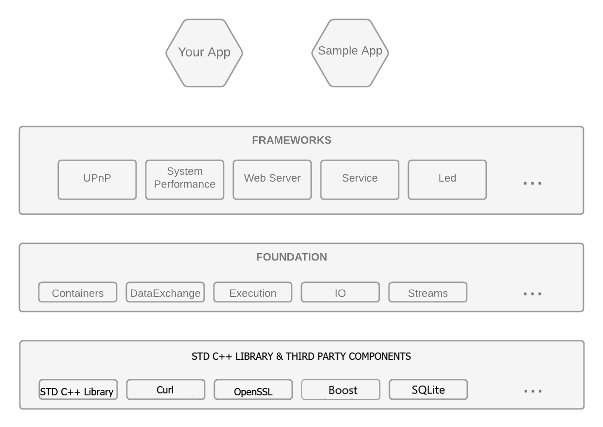

# Stroika v2.1

Stroika is a modern, portable, thread-savvy, C++ application framework. It makes writing high performance C++ applications easier by providing safe, flexible, modular building blocks which can be easily combined.

Stroika works ***with*** the standard C++ library, layered on top, and prodivdes simpler to use (higher level) classes, with more safety checking guarantees, and wider domain of applicability (because it doesn't need to wait for a committee to agree on every last detail, and 'good now', trumps 'great maybe someday').

Stylistically, Stroika differs from boost, in that it (relatively) embraces object oriented abstractions over template-based genericity (see [Stroika-Approach-To-Performance.md](Documentation/Stroika-Approach-To-Performance.md)) because the abstraction of type hierarchies is so much better suited to how people reason. And Stroika emphasizes separation of interface from implementation, carefully documenting the interface in the headers, and separating the implementation to other files.

Stroika is comprised of 2 layers, the [Foundation](Library/Sources/Stroika/Foundation/ReadMe.md), which provides directly usable classes, and a series of domain specific [Framework](Library/Sources/Stroika/Frameworks/ReadMe.md)s which provide a rich collection of code in different domains.

The Frameworks depend on the Foundation; Foundation modules frequently depend on each other; but Foundation layer code contains no dependencies outside of the Foundation (except on std C++ layer libraries, and various ThirdPartyComponent libraries optionally included or referenced, like openssl).

- Nearly all public interfaces and methods are well documented; implementations are clear and well commented.
- Thoroughly integrated assertions (including thread-safety assertions) help document and enforce usage patterns (without performance cost in production builds).
- Each release is tested with Valgrind, Google Sanitizers, Github CodeQL, and a variety of platforms and compilers, as well as a large body of regression tests (including most documentation examples) to help assure library correctness.
- [Sample applications](Samples/ReadMe.md) help show common use cases (like building a web server into your app to deliver web-service content and APIs).
- [Quick start using pre-built Docker containers](/Documentation/Building%20Stroika.md#build-with-docker) (for Windows, and Linux).

## Stroika [Foundation](Library/Sources/Stroika/Foundation/ReadMe.md) provides

- [Cache classes](Library/Sources/Stroika/Foundation/Cache/ReadMe.md) (a variety of different caching/memoizing strategies directly supported).
- [Characters classes](Library/Sources/Stroika/Foundation/Characters/ReadMe.md) (simpler to use - especially with UNICODE - Strings class, with functional style mappings - to ToString\<template\>() for most Stroika objects).
- [Container classes](Library/Sources/Stroika/Foundation/Containers/ReadMe.md) (Collection, Queue, Mapping, Sequence, Set, and much more, each with rich variety of backend implementations).
- [DataExchange](Library/Sources/Stroika/Foundation/DataExchange/ReadMe.md) (VariantValue, rich collection of data format serializer/deserializers - like JSON, object to/from serialization mappings, and much more).
- [Execution](Library/Sources/Stroika/Foundation/Execution/ReadMe.md) pattern classes (external process runner, synchronization patterns, blocking queue, thread pools, and much more).
- [Networking](Library/Sources/Stroika/Foundation/IO/Network/ReadMe.md) support (high level socket wrappers, Web client fetching).
- Simple, elegant [streams library](Library/Sources/Stroika/Foundation/Streams/ReadMe.md), with adapters for cryptography, compression, text transforms, etc.
- Seamless integration (object oriented wrappers respecting Stroika's safety and adapter rules) with many important libraries , including: boost, libcurl, lzma sdk, openssl, sqlite, xerces, zlib (e.g. wrap a compression stream - using for example zlib).
- and more...

## Stroika [Framework](Library/Sources/Stroika/Frameworks/ReadMe.md)s provides

- [network measurement](Library/Sources/Stroika/Frameworks/NetworkMonitor/ReadMe.md)
- SSDP/[UPnP](Library/Sources/Stroika/Frameworks/UPnP/ReadMe.md)
- [system performance monitoring](Library/Sources/Stroika/Frameworks/SystemPerformance/ReadMe.md)
- [text editing/word processor](Library/Sources/Stroika/Frameworks/Led/ReadMe.md)
- [web server](Library/Sources/Stroika/Frameworks/WebServer/ReadMe.md)
- [web services](Library/Sources/Stroika/Frameworks/WebService/ReadMe.md)
- and more...

## Trade-offs

Stroika's biggest strength is also its biggest weakness:

- There are smaller, more focused libraries that do many of the things Stroika does. Being single purpose is a form of modularity (good) and allows for easy adoption/integration. But libraries that do anything of any complexity must create their own infrastructure for a wide variety of building block problems (e.g. Xerces has its own stream classes, pistache date classes, etc). And if you have two such libraries, they are unlikely to interact seemlessly, and their support classes (for stuff like date and streams above) certainly won't.
- Stroika takes the approach of building its functionality in layers, leveraging other components (e.g. Streams and Containers) in lower layers (as well as standardized C++ libraries). This slightly increases the cost of adopting Stroika for something small (because pulling one thing in pulls many things in), but then pays dividends as you use it to accomplish a second or third task.

## Versions

- Stroika v3 development has started, and requires C++20 or later.

- Stroika v2.1 is stable (in maintainance), and requires C++17 or later. Version 2.1 also conditionally supports many C++20 features (such as three-way-comparison etc, if available).

- Stroika v2.0 is very stable, and requires C++14 or later. Stroika v2.0 is used to power a wide variety of open source and commercial applications.

## Compilers / Platforms regularly tested/supported

- Linux, MacOS, Windows

- Stroika v2.1

  Tested on x86, arm (+m1), gcc8 thru gcc11, clang 6 thru clang 12, Visual Studio.Net 2017, Visual Studio.Net 2019 and Visual Studio.Net 2022, XCode 13.

- Stroika v2.0

  Tested on x86, arm, gcc5 thru gcc8, clang 3 thru clang 6, XCode 8 thru 9.

## CI System Integration

- Github Actions

  | [Branches](https://github.com/SophistSolutions/Stroika) |                                                                                                                               Status                                                                                                                                |                                                                                                    |
  | :------------------------------------------------------ | :-----------------------------------------------------------------------------------------------------------------------------------------------------------------------------------------------------------------------------------------------------------------: | :------------------------------------------------------------------------------------------------- |
  | **v2.1-Release**                                        |  | [.github/workflows/build-N-test-v2.1-Release.yml](.github/workflows/build-N-test-v2.1-Release.yml) |
  | **v2.1-Dev**                                            |                      | [.github/workflows/build-N-test-v2.1-Dev.yml](.github/workflows/build-N-test-v2.1-Dev.yml)         |

## Random Features

- Vanilla make based builds
- Portable API (targets windows/mac/unix), and multiple processors

## Summary

For more details on individual release changes, see:

&nbsp;&nbsp;&nbsp;&nbsp;[Release-Notes.md](Release-Notes.md)

"Getting Started", build instructions, design and other documentation:

&nbsp;&nbsp;&nbsp;&nbsp; [Documentation/](Documentation/ReadMe.md)

Looking through the samples is also a good way to start:

&nbsp;&nbsp;&nbsp;&nbsp;[Samples/](Samples/ReadMe.md)

Please report bugs/issues at:

&nbsp;&nbsp;&nbsp;&nbsp;[http://stroika-bugs.sophists.com](http://stroika-bugs.sophists.com)
