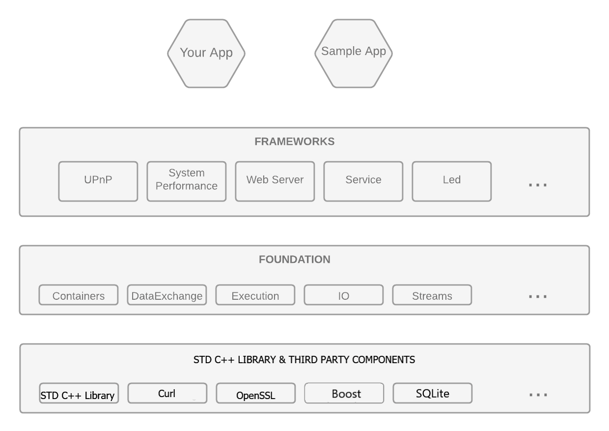

# Stroika v3 - modern C++ made easy

Stroika is a modern, portable, C++ application framework. It makes writing C++ applications easier by providing safe, flexible, building blocks, as well as wrappers on other useful libraries that help them to all work together more seemlessly. 

 
Code snippets / examples

  

    
String class UNICODE interoperability, more convenient methods

  ~~~c++
  extern void CallFunction (String);

  String a = u8"£50";

  // regardless of which way constructed, 
  // stored internally compactly (in this case 5 bytes for data)
  String b = u32" abc ";

  CallFunction (a+b);

  // trim whitespace, and convert to u16string for some legacy API
  std::u16string uuu = (a+b).Trim ().As<u16string>();

  // tokenize
  String t{ "ABC DEF G" };
  Assert (t.Tokenize ()[1] == "DEF");
  ~~~
  

  

  
_f strings, c++20 format, works with stroika types

  ~~~c++
  // most Stroika types automatically support formattable<>
  DbgTrace ("v = {}"_f, v);   // to a tracelog file, or debugger
  cerr << "v = {}"_f (v) << endl;   // OR iostreams (unicode mapped automatically)
  ~~~
  

  

  
Iterable&lt;T> - easy to use functional APIs on all iterables, similar to C# LINQ

  Similar to c++20 ranges API, but much easier to use (like C# Linq): methods of iterable objects easier
  to select with smart (e.g. vscode) editor than (std::ranges).

  ~~~c++
  // nb: String is an Iterable<Character>, 
  // despite internally representing the characters very differently
  bool IsAllWhitespace (String s) const
  {
    return not s.Find ([] (Character c) -> bool { return not c.IsWhitespace (); });
  }

  Iterable<int> c { 1, 2, 2, 5, 9, 4, 5, 6 };
  EXPECT_TRUE (c.Distinct ().SetEquals ({ 1, 2, 4, 5, 6, 9 }));

  // Map iterates over 'c' and produces the template argument container
  // automatically by appending the result of each lambda application
  Iterable<int> c { 3, 4, 7 };
  vector<String> vv = c.Map<vector<String>> ([] (int i) { return "{}"_f (i); });
  EXPECT_EQ (vv, (vector<String>{"3", "4", "7"}));

  // Use Map<> to transform, select subobjects, and filter, and pipe into algorithms like Median
  DateTime now = DateTime::Now ();
  auto medianDurationOfOpenConnections =
    connections.Map<Iterable<Duration>> ([&] (auto c) { return now - c.fCreatedAt; }).Median ();
  auto medianDurationOfActiveConnections = 
    connections
      .Map<Iterable<Duration>> ([&] (const auto& c) -> optional<Duration> {
          if (c.fActive == false)
              return nullopt;
          return now - c.fCreatedAt;
      })
      .Median ();
  ~~~
 

  
Containers (are Iterable&lt;something>)

- COW (copy-on-write) often signifcantly improves performance for most common cases
- APIs organized by access pattern: representational transparency (e.g. Sequence might be implemented as array, linked list, or memory mapped file)
  
  ~~~c++
  extern void f(Set<int>);  // define API in terms of ArchType 'Set<int>'

  // use the default Set<> representation - the best for type 'int'
  Set<int> s{1, 2, 3};

  // as if copy-by-value, but data not actually copied -
  // Stroika containers use 'copy-on-write (COW)'
  f(s);

  s = Concrete::SortedSet_SkipList<int>{s}; // Use a skiplist to represent the set

  f(s);  // call f the same way regardless of data structure used for implementation
  
  // set equality not order dependent (regardless of data structure)
  Assert (s == {2,3,1});  

  Mapping<int, int> m;
  m.Add (3, -3);
  m.Add (19, -19);
  if (m.Lookup (5)) {
      AssertNotReached (); // better not find it
  }

  Stack<String> stack;  // automatically picks data represenation
  stack.Push ("hello");
  auto r = stack.Pop ();
  ~~~

  See [Containers Sample](./Samples/Containers/ReadMe.md) for more details;
  Stroika provides a rich set of container [archtypes, and data structure implmentations](./Library/Sources/Stroika/Foundation/Containers/ReadMe.md).
  

  

  
Streams vs std::iostream

  
  - formatting not intrinsic, but uses std::format / _f strings
  - simple abstractions so easy to implement your own stream classes (InputStream::IRep\<T>,OutputStream::IRep\<T>)
  - designed for synchronous case, but async APIs available for when needed (e.g. ReadIfAvailable() returns optional - no modes)

  ~~~c++
  MemoryStream::Ptr<byte> tmpStream = MemoryStream::New<byte> ();
  tmpStream.Write (BLOB{...});  // just write binary data to the stream
  
  TextReader::Ptr r = TextReader::New (tmpStream);  // optional args for character codes
  String asStr = r.ReadAll ();  // read that data back as strings

  // persist these to file
  using namespace IO::FileSystem;
  FileOutputStream::Ptr tmpFileStream =
      FileOutputStream::New (WellKnownLocations::GetTemporary () / "t.txt");
  tmpFileStream.Write (BLOB{});
  // or write text
  TextWriter::New (tmpFileStream/*,optionally specify codepage/conversions*/).Write (asStr);
  ~~~
  

  

  
Streams and ObjectVariantMapper

  ~~~c++
  MyClass someObject = ...;
  VariantValue v = mapper.FromObject (someObject);   // Map object to a VariantValue

  // Serialize using any serialization writer defined in 
  // Stroika::Foundation::DataExchange::Variant (we selected JSON)
  Streams::MemoryStream::Ptr<byte> tmpStream = Streams::MemoryStream::New<byte> ();
  Variant::JSON::Writer{}.Write (v, tmpStream);

  // You can persist these to file if you wish
  using namespace IO::FileSystem;
  FileOutputStream::Ptr tmpFileStream =
      FileOutputStream::New (WellKnownLocations::GetTemporary () / "t.txt");
  Variant::JSON::Writer{}.Write (v, tmpFileStream);
  ~~~
  See [Serialization Sample](./Samples/Serialization/ReadMe.txt) for more details
  

  
  

  
Streams and networking (SSL)

  ~~~c++
  auto [pk, cert] = Certificate::New (Certificate::SelfSignedCertParams{
        .fSubject = {.fCountry = "US"sv, .fOrganization = "MyCompany Inc."sv, .fCommonName = "localhost"sv}});
  auto [fromRawSocket, toRawSocket] = ConnectionOrientedStreamSocket::NewPair (SocketAddress::INET);
  Thread::Ptr clientThread{Thread::New (
        [&] () {
            ClientContext::Options clientOptions;
            auto p = Cryptography::SSL::SocketStream::New (fromRawSocket, clientOptions);
            auto writingStream = TextWriter::New (p); // treat byte stream as Character stream
                                                      // could select characterset/mapping here
            writingStream.Write ("Hello"sv);
            writingStream.Close (); // so ReadAll in doReaderSide doesn't block waiting for more data
        },
        Thread::eAutoStart, "client"sv)};
  Thread::Ptr serverThread{Thread::New (
        [&] () {
            ServerContext::Options serverOptions{.fCertificate = make_tuple (pk, cert)};
            auto p = Cryptography::SSL::SocketStream::New (toRawSocket, serverOptions);
            auto readData      = TextReader::New (p).ReadAll (); // ReadAll () waits for writer side to close
            EXPECT_EQ (readData, "Hello"sv);
        },
        Thread::eAutoStart, "server"sv)};
  Thread::WaitForDone ({clientThread, serverThread});
  ~~~
  

  

  
Build WebServies into your application

  ~~~c++
  Route{"variables/(.+)"_RegEx,
    // explicit message handler
    [this] (Message& m, const String& varName) {
        WriteResponse (m.rwResponse (), kVariables_, 
                       kMapper.FromObject (fWSImpl_->Variables_GET (varName)));
  }},
  Route{HTTP::MethodsRegEx::kPost, "plus"_RegEx,
    // automatically map high level functions via ObjectVariantMapper
    ObjectRequestHandler::Factory{
      kBinaryOpObjRequestOptions_,
      [this] (Number arg1, Number arg2) { return fWSImpl_->plus (arg1, arg2); }}},
  ~~~
  See [WebServices sample](Samples/WebService/ReadMe.md) for more details.
  

Stroika provides a layer on top of the Standard C++ Library, with simpler to use (higher level) classes, more safety checking guarantees (in debug builds), and addressing areas not standardized (such as networking). But those Stroika classes seamlessly integrate with standard C++ classes, and your code can easily use as much of either library as preferences dictate.

Stylistically, Stroika differs from the Standard C++ Library, boost, and many other C++ libraries, in that it (relatively) embraces object oriented abstractions over template-based genericity (see [Stroika-Approach-To-Performance.md](Documentation/Stroika-Approach-To-Performance.md)). The abstraction of type hierarchies is better suited to how people reason, and templates and concepts - while powerful - can be fiddly and obscure programmer intent. Also, Stroika emphasizes separation of interface from implementation: carefully documenting the interface in the headers, and separating the implementation to other files.

Stroika is comprised of 2 layers: the [Foundation](Library/Sources/Stroika/Foundation/), which provides building-block classes applicable to most applications, and a series of domain specific [Framework](Library/Sources/Stroika/Frameworks/)s which provide a rich collection of code in different domains.

The Frameworks depend on the Foundation; Foundation modules frequently depend on each other; but Foundation layer code contains no dependencies outside of the Foundation (except on the Standard C++ Library, and various ThirdPartyComponent libraries optionally included or referenced, like openssl).

## Quick Start

Don't want to read - just want to code. Step by step instructions to build
your first stroika-based application on your machine, in minutes (less download/compile times - that varies).

- [Quick-Start.md](Documentation/Quick-Start.md)

## Quality

- Nearly all public interfaces and methods are well documented; implementations are clear and well commented.
- Thoroughly integrated assertions (including thread-safety assertions) help document and enforce usage patterns (without performance cost in production builds).
- Each release is tested with Valgrind (memcheck), Google Sanitizers (TSAN, UBSAN, LEAK, and ASAN), Github CodeQL, and a variety of platforms and compilers, as well as a large body of regression tests (including most documentation examples) to help assure library correctness.
- [Sample applications](Samples/) help show common use cases (like building a web server into your app to deliver web-service content and APIs).
- [Quick start using pre-built Docker containers](Documentation/Building%20Stroika.md#build-with-docker) (for Windows, and Linux).

## Stroika [Foundation](Library/Sources/Stroika/Foundation/) provides

- [Cache classes](Library/Sources/Stroika/Foundation/Cache/) (a variety of different caching/memoizing strategies directly supported).
- [Characters classes](Library/Sources/Stroika/Foundation/Characters/) (simpler to use - especially with UNICODE - Strings class, with functional style mappings, and ToString() utility for most Stroika objects).
- [Container classes](Library/Sources/Stroika/Foundation/Containers/) (Collection, Queue, Mapping, Sequence, Set, and much more, each with rich variety of backend implementations).
- [DataExchange](Library/Sources/Stroika/Foundation/DataExchange/) (VariantValue, rich collection of data format serializer/deserializers - like JSON, XML, object to/from serialization mappings, and much more).
- [Execution](Library/Sources/Stroika/Foundation/Execution/) pattern classes (external process runner, synchronization patterns, blocking queue, thread pools, and much more).
- [Networking](Library/Sources/Stroika/Foundation/IO/Network/) support (high level socket wrappers, Web client fetching).
- Simple, elegant [streams library](Library/Sources/Stroika/Foundation/Streams/), with adapters for cryptography, compression, text transforms, etc.
- Seamless integration (object oriented wrappers respecting Stroika's safety and adapter rules) with many important libraries , including: boost, libcurl, lzma sdk, openssl, sqlite, xerces, zlib (e.g. wrap a compression stream - using for example zlib).
- and [more](Library/Sources/Stroika/Foundation/)...

## Stroika [Framework](Library/Sources/Stroika/Frameworks/)s provides

- [network measurement](Library/Sources/Stroika/Frameworks/NetworkMonitor/)
- SSDP/[UPnP](Library/Sources/Stroika/Frameworks/UPnP/)
- [system performance monitoring](Library/Sources/Stroika/Frameworks/SystemPerformance/)
- [text editing/word processor](Library/Sources/Stroika/Frameworks/Led/)
- [web server](Library/Sources/Stroika/Frameworks/WebServer/)
- [web services](Library/Sources/Stroika/Frameworks/WebService/)
- and [more](Library/Sources/Stroika/Frameworks/)...

## Trade-offs

Stroika's biggest strength is also its biggest weakness:

- There are smaller, more focused libraries that do many of the things Stroika does. Being single purpose is a form of modularity (good) and allows for easy adoption/integration. But libraries that do anything of any complexity must create their own infrastructure for a wide variety of building block problems (e.g. Xerces has its own stream classes, pistache date classes, etc). And if you have two such libraries, they are unlikely to interact seemlessly, and their support classes (for stuff like date and streams above) certainly won't.
- Stroika takes the approach of building its functionality in layers, leveraging other components (e.g. Streams and Containers) in lower layers (as well as standardized C++ libraries). This slightly increases the cost of adopting Stroika for something small (because pulling one thing in pulls many things in), but then pays dividends as you use it to accomplish a second or third task.

## Versions (major branches)

- Stroika v3 in active development (**not stable**), and requires C++20 or later.

- Stroika v2.1 is **stable** (in maintainance), and requires C++17 or later. Version 2.1 also conditionally supports many C++20 features (such as three-way-comparison etc, if available).

- Stroika v2.0 is very stable, and requires C++14 or later. Stroika v2.0 is used to power a wide variety of open source and commercial applications.

## Compilers / Platforms regularly tested/supported

- Linux, MacOS, Windows

- Stroika v3

  TBD, but so far looks like vs2k22 (17.9) or later on windows, XCode 15(.2) or later on MacOS, and g++11 or later, and clang++15 or later.

- Stroika v2.1

  Tested on x86, arm (+m1), gcc 8 thru gcc 12, clang 6 thru clang 14, Visual Studio.Net 2017, Visual Studio.Net 2019 and Visual Studio.Net 2022, XCode 13, 14, 15.

- Stroika v2.0

  Tested on x86, arm, gcc 5 thru gcc 8, clang 3 thru clang 6, XCode 8 thru 9.

## CI System Integration

- Github Actions

  | [Branches](https://github.com/SophistSolutions/Stroika) |                                                                                                                               Status                                                                                                                                |                                                                                                    |
  | :------------------------------------------------------ | :-----------------------------------------------------------------------------------------------------------------------------------------------------------------------------------------------------------------------------------------------------------------: | :------------------------------------------------------------------------------------------------- |
  | **v3-Release**                                        |  | [.github/workflows/build-N-test.yml](.github/workflows/build-N-test.yml) |
  | **v3-Dev**                                            |                      | [.github/workflows/build-N-test.yml](.github/workflows/build-N-test.yml)         |

## Random Features

- Vanilla make based builds
- Portable API (targets windows/mac/unix), and multiple processors

## Summary

For more details on individual release changes, see:

&nbsp;&nbsp;&nbsp;&nbsp;[Release-Notes.md](Release-Notes.md)

"Getting Started", build instructions, design and other documentation:

&nbsp;&nbsp;&nbsp;&nbsp; [Documentation/](Documentation/)

Looking through the samples is also a good way to start:

&nbsp;&nbsp;&nbsp;&nbsp;[Samples/](Samples/)

Please report bugs/issues at:

&nbsp;&nbsp;&nbsp;&nbsp;[http://stroika-bugs.sophists.com](https://stroika.atlassian.net/jira/dashboards/10000)
